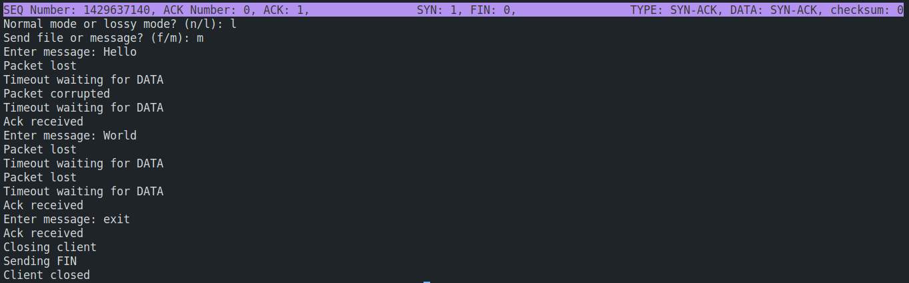
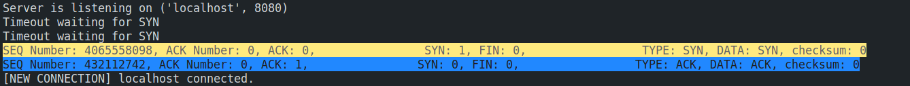
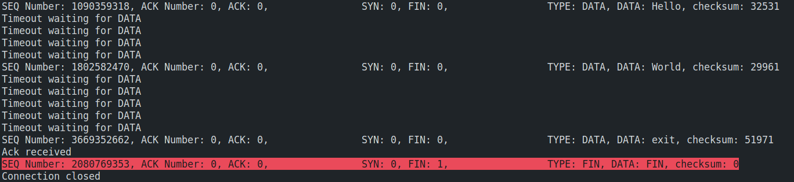
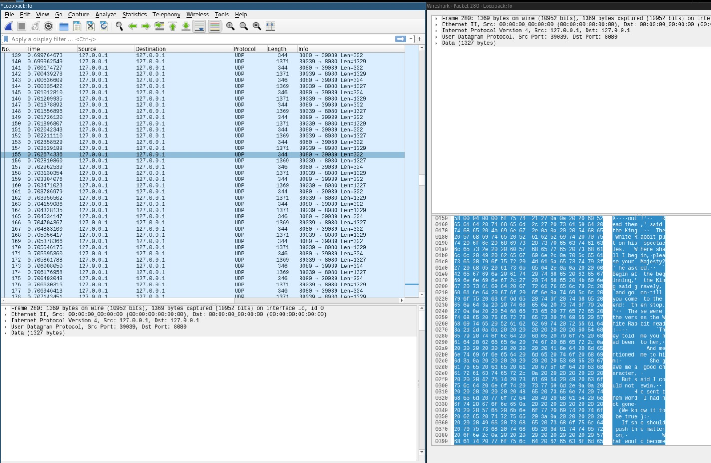

# TCP on UDP simulation

Stimulating TCP packets using a UDP connection by extending the user space of your application while maintaining reliability and supporting the HTTP protocol on top of UDP.

## Run Locally

1. Clone the project

```bash
git clone git@github.com:iZarrios/tcp-on-udp-simulation.git
```

2. Go to the project directory

```bash
cd tcp-on-udp-simulation
```

3. Install dependencies

```bash
pip install load_dotenv
```

4. Start the server and the client

```bash
python3 server.py
```

```bash
python3 client.py
```

## Running Tests

### Sending a message in loosy mode

### Client side


### Server side



## Sending a file in normal mode

### Wireshark


## Authors

-   [@HossamShaybon](https://github.com/HossamShaybon)
-   [@iZarrios](https://github.com/iZarrios)
-   [@ZeyadZakaria01](https://github.com/ZeyadZakaria01)
